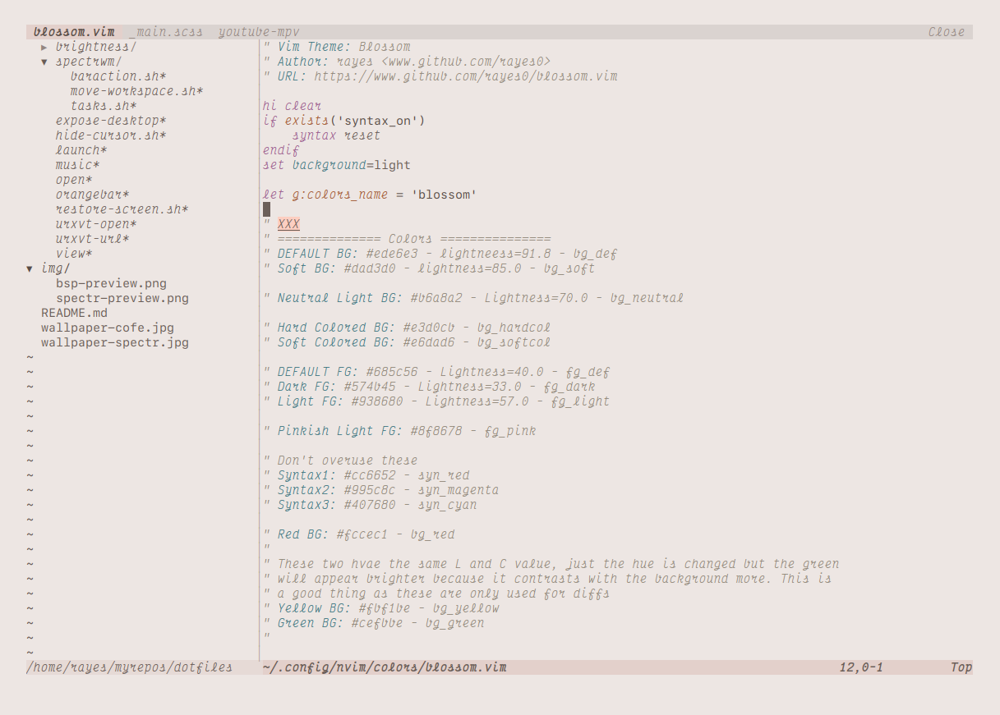

# blossom.vim

> What a strange thing!  
to be alive  
beneath cherry blossoms.

  - Haiku by Kobayashi Issa

<br>




#### Install

*You need a *true color* terminal for this theme to work*.

Vim plug example:

```
Plug 'rayes0/blossom.vim'
```

#### Usage

```
set termguicolors
colorscheme blossom
```

